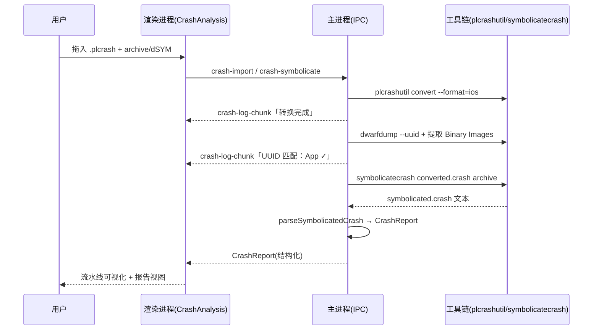

# flyWork 产品需求文档（PRD）：iOS 崩溃定位分析（DSYM + .plcrash 符号化）

| 字段 | 内容 |
| --- | --- |
| 文档版本 | v1.1（依据评审意见修订） |
| 作者 | flyWork 产品 / 工程 |
| 创建日期 | 2026-08-10 |
| 状态 | 待评审 |
| 关联模块 | 崩溃分析（Crash Symbolication） |
| 参考实现 | `/Users/dimoo/Desktop/works/PetPal/scripts/symbolicate_plcrash.sh` |

---

## 0. 本次修订要点（v1.0 → v1.1）

| # | 评审意见 | 处理 |
| --- | --- | --- |
| 1 | `plcrashutil` 用 `/Users/dimoo/bin/plcrashutil`，确认能否打包进项目 | 确认可打包；vendoring 到 `resources/`，经 `extraResources` 进入 `Contents/Resources/`，构建期重签名（见 §6.1 / §10）。保留 PATH / 自定义路径兜底。 |
| 2 | dSYM 不需整理，仅单次定位，本地拖入路径即可 | 删除「符号库持久化索引」设计；改为**每次会话拖入 archive/dSYM 路径，一次性定位**（见 FR-2）。 |
| 3 | 符号化过程参考 `symbolicate_plcrash.sh`，但报告改成可视化过程 | 引擎对齐脚本流水线（`plcrashutil --format=ios` + `symbolicatecrash`）；最终产物不再落文本 `.crash`，改为**可视化流水线 + 结构化报告**（见 FR-3 / FR-4 / §6.4）。 |

---

## 1. 背景与现状

### 1.1 当前项目定位

flyWork 是一款面向开发者的 macOS 桌面效率工具（Electron + React 19 + Vite + electron-vite + electron-builder）。核心价值：把分散的开发工作流收敛到一个工作台（本地项目、Git、自动化、AI 编程助手、云效 DevOps）。

### 1.2 已完成功能盘点（已实现、经代码核对）

| 模块 | 已实现要点 |
| --- | --- |
| 工作区管理 | 目录关联本地工程、Git 状态实时监控（分支/修改文件/最近提交） |
| Git 操作 | 提交/推送/拉取/暂存/放弃/分支 checkout·创建/单文件 stage/最近提交 |
| AI 提交 | 对接 Bug AI 后端生成 Conventional Commit |
| 自动化 | 多步骤命令管道、Dry Run、流式输出、Git 环境变量、动作白名单 |
| AI Agent 集成 | 检测 Claude Code/Codex/OpenCode/Gemini，读取原生存储会话与线程 |
| 命令中心 | ⌥Space/⌘K 全局快捷键，快速开 Xcode/终端/Finder、跑 Git |
| 云效 DevOps | Token 加密存储、组织/项目/工作项/迭代/评论/附件/仪表板 |
| 其他 | 系统托盘、审计日志、收件箱、今日视图、深色+vibrancy |

### 1.3 能力缺口

发布后质量闭环缺失：开发者拿到 PLCrashReporter 上报的 `.plcrash` 原始二进制崩溃日志后，仍需手动用 `plcrashutil` + `symbolicatecrash` + `.dSYM` 符号化。本 PRD 补齐「崩溃定位」一环。

---

## 2. 目标与范围

### 2.1 目标

提供一个**本地优先、隐私安全**的 iOS 崩溃符号化工作台：

1. 导入 PLCrashReporter 上传的**原始 `.plcrash` 二进制崩溃日志**（单文件 / 批量）。
2. 每次定位时**拖入对应符号文件**（` .xcarchive` / `.app.dSYM` / `.app.dSYM.zip`，无需事先整理），按 UUID 自动匹配 App 主二进制与各动态库。
3. 自动符号化崩溃线程调用栈，定位到 `源码文件:行号` 与函数名。
4. 将脚本式的符号化过程与结果，**改为可视化呈现**（流水线进度 + 结构化报告）。

### 2.2 非目标（本期不做）

- 不做线上崩溃聚合 / 大盘（不替代 Crashlytics / Bugly / Sentry）。
- 不做符号文件远程上传（`.dSYM` 仅本机读取，不外发）。
- 不做持久化的符号库索引 / 集中管理（按 v1.1 评审意见删除）。
- 不符号化第三方闭源系统库（除非用户本机提供对应 `DeviceSupport` 符号）。
- 不做 Android / 其他平台崩溃解析。

### 2.3 成功度量

- 单次「导入 .plcrash + 拖入 dSYM → 出可视化报告」≤ 10 秒（本地，dSYM 命中）。
- 崩溃线程栈帧符号化结果与 Xcode / `symbolicatecrash` 原生结果一致。
- 用户无需记忆任何命令行参数即可完成符号化与可视化查看。

---

## 3. 术语与前置知识

| 术语 | 说明 |
| --- | --- |
| **PLCrashReporter** | 开源 iOS 崩溃采集库；崩溃时写出 `.plcrash`（基于 protobuf 的二进制格式）。 |
| **.plcrash** | 原始崩溃日志（二进制）。参考脚本用 `plcrashutil convert --format=ios` 转为 Apple `.crash` 文本。 |
| **--format=ios** | `plcrashutil` 的转换格式，产出 Apple CrashReporter 兼容的 `.crash` 文本，供 `symbolicatecrash` 消费。 |
| **.xcarchive / .app.dSYM / .app.dSYM.zip** | 符号来源；`.zip` 会在临时目录解压后使用。 |
| **symbolicatecrash** | Xcode 自带的 Perl 符号化脚本，读入 `.crash` + dSYM，输出符号化后的 `.crash`（含 `文件:行`）。需**完整 Xcode**（路径在 `DVTFoundation.framework/.../symbolicatecrash`）。 |
| **UUID 匹配** | 崩溃报告中 Binary Images 的 UUID 须与 dSYM 的 UUID 完全一致，否则符号化无意义。参考脚本用 `dwarfdump --uuid` 提取 dSYM UUID 做版本核对。 |
| **可视化符号化过程** | 将「转换 → UUID 核验 → symbolicatecrash → 解析渲染」以步骤流 + 实时日志呈现，而非仅落一个文本文件。 |

---

## 4. 用户角色与场景

| 角色 | 典型场景 |
| --- | --- |
| iOS 开发者 | QA 发来 `.plcrash`，拖入对应 `.xcarchive`，1 分钟内看到可视化崩溃栈。 |
| 测试 / QA | 从真机导出 `.plcrash`，本地拖入归档里的 `.dSYM` 直接出报告。 |
| 技术负责人 | 批量导入多份崩溃，按崩溃原因聚类，决定先修哪条。 |

---

## 5. 功能需求（FR）

### FR-1 崩溃日志导入

- FR-1.1 支持「拖拽」与「文件选择」导入 `.plcrash`（复用现有 `show-open-dialog` 通道），允许多选 / 目录批量。
- FR-1.2 自动识别是否为合法 PLCrashReporter 格式；非本格式给出明确错误。
- FR-1.3 解析后提取元数据：设备型号、系统版本、App 版本 / Build、异常类型、崩溃线程号、进程名（由 `plcrashutil` 转换结果解析）。
- FR-1.4 调用内置 `plcrashutil convert --format=ios` 把 `.plcrash` 转为 Apple 格式 `.crash`（中间产物，用于后续符号化与解析）。

### FR-2 符号文件（单次拖入，不做索引）

- FR-2.1 每次定位时，用户**拖入或选择**一个符号来源：` .xcarchive` / `.app.dSYM` / `.app.dSYM.zip` 其一即可（对齐参考脚本的 `--archive` 参数）。
- FR-2.2 **不**建立持久符号库；仅本次会话使用，关闭即释放。`.zip` 在临时目录解压后取其中 `.dSYM`。
- FR-2.3 引擎内部按 Binary Images 的 UUID 与该 dSYM 的 UUID 做**版本匹配核验**，并在可视化面板标注「命中 / 缺失 / 不匹配」。无索引、无整理。
- FR-2.4 支持用户手动重新指定 dSYM 以纠正。

### FR-3 符号化引擎（对齐参考脚本 + 可视化）

引擎严格复刻 `symbolicate_plcrash.sh` 的流水线，但产物改为结构化数据而非文本文件：

1. **格式转换**：`plcrashutil convert --format=ios report.plcrash > converted.crash`。
2. **UUID 核验**：提取转换后报告的 `Binary Images` 段落与 `dwarfdump --uuid <dSYM>` 的 UUID，逐镜像比对，输出匹配结果（用于可视化与正确性判定）。
3. **符号化执行**：`symbolicatecrash converted.crash <archive/dSYM>`，得到符号化后的 `.crash` 文本（含 `文件:行`）。
4. **解析渲染**：解析符号化后的 `.crash`，构建结构化 `CrashReport`（异常、线程、帧、UUID 匹配表）。

每一步均产生可展示的中间状态（见 FR-4 的「流水线视图」），并用**流式日志**呈现（复用现有 `automation-log-chunk` 事件机制）。

- FR-3.1 系统库（如 `libsystem_kernel.dylib`）若无本机符号则保留原始地址并标注「系统帧（未符号化）」。
- FR-3.2 工具链缺失（`plcrashutil` / `symbolicatecrash` / Xcode）时禁用对应能力并给出引导，不静默失败。
- FR-3.3 保留原始 pc 与符号化结果对照，便于审计。

### FR-4 可视化符号化过程与报告

**A. 流水线视图（过程可视化）** —— 替代原「文本 .crash 产物」：
- 步骤卡：`① 导入校验 → ② 格式转换 → ③ UUID 匹配核验 → ④ 符号化执行 → ⑤ 解析渲染`。
- 每步显示状态（等待 / 进行中 / 成功 / 失败）+ 关键中间数据：
  - 转换：耗时、生成临时 `.crash` 路径。
  - UUID 核验：`App UUID = xxx`，`dSYM UUID = xxx`，逐镜像 `✓/✗/⚠`。
  - 符号化：实时控制台日志（流式）。
- 底部统一「控制台」面板复用流式日志机制。

**B. 报告视图（结果可视化）**：
- FR-4.1 摘要卡：Incident ID、异常类型（如 `EXC_BAD_ACCESS (SIGSEGV)` / `NSInvalidArgumentException`）、触发线程、进程、App 版本 / Build、设备 / 系统版本、时间。
- FR-4.2 线程导航：线程列表，`Triggered by Thread` / Crashed 线程默认展开并**高亮**，其余可折叠。
- FR-4.3 每行栈帧：`#N  binary  0xADDR  symbolName (File.swift:123)`，点击行可复制完整帧。
- FR-4.4 UUID 匹配面板：逐镜像匹配状态，缺失项红色提示。
- FR-4.5 提供「复制符号化全文」「导出 Markdown / JSON 报告」按钮，报告可记入活动日志（复用 `audit.log`）。

### FR-5 历史与持久化

- FR-5.1 解析后的**报告对象**（非原始文本）写入 `~/.flywork/data.json` 的 `crashReports` 节点，便于重开 / 检索。
- FR-5.2 列表视图按时间倒序，可重开历史报告、删除、按崩溃原因搜索。
- FR-5.3 **不**持久化 dSYM 路径与符号库（按 v1.1 评审意见）。

### FR-6（可选 / 拉伸）AI 根因分析

- FR-6.1 复用现有 Bug AI 后端，输入「符号化后的崩溃摘要 + 异常类型」，输出人话根因与排查建议。
- FR-6.2 失败时降级为「仅展示可视化结果」，不阻塞主流程。

---

## 6. 技术实现方案

### 6.1 工具链与打包

| 工具 | 用途 | 获取 / 打包 | 检测 |
| --- | --- | --- | --- |
| `plcrashutil` | `.plcrash` → Apple `.crash` | **内置打包**：vendoring 到 `resources/plcrashutil`；`electron-builder` 经 `extraResources` 落到 `Contents/Resources/plcrashutil`；运行时用 `process.resourcesPath + '/plcrashutil'` 引用。兜底：PATH 查找 / 用户自定义路径（对齐脚本 `--plcrashutil`）。 | `fs.existsSync(bundledPath)` 或 `command -v plcrashutil` |
| `symbolicatecrash` | 符号化 | **需完整 Xcode**：`xcrun --find symbolicatecrash`，回退 `$DEVELOPER_DIR/../SharedFrameworks/DVTFoundation.framework/Versions/A/Resources/symbolicatecrash`（同参考脚本）。 | `xcrun --find symbolicatecrash` |
| `dwarfdump` | 读取 dSYM 的 UUID | Xcode CLT 自带。 | `xcrun --find dwarfdump` |

**打包与签名要点（针对评审意见 1）**：
- 当前 `/Users/dimoo/bin/plcrashutil` 为 **ad-hoc 签名**（无 Team ID）。直接打包进 `.app` 后，若走 macOS 公证（notarization），**必须**在构建阶段用 Developer ID 证书对 `Contents/Resources/plcrashutil` 重新签名（electron-builder 在执行 `afterSign` 或 mac 打包代码签名时会覆盖签名 `extraResources`；需确认打包配置启用 mac 代码签名）。
- 若不走公证（仅内部分发 / 个人使用），ad-hoc 签名可直接运行（本机已授权）。
- 建议：把二进制提交进仓库 `resources/`，构建脚本中显式 `codesign --force --options runtime --sign "Developer ID"` 加固（hardened runtime）。
- 二进制体积 368KB，universal（x86_64+arm64），对包体影响可忽略。

### 6.2 主进程服务模块（新增 `src/main/services/crash/`）

```
src/main/services/crash/
├── plcrash.js        // 调内置 plcrashutil 转 --format=ios；解析 Binary Images / 元数据
├── dsym.js           // 单次 UUID 匹配（dwarfdump --uuid），不做持久索引
├── symbolicate.js    // 调 symbolicatecrash；解析符号化后 .crash → CrashReport；流式日志
└── report.js         // 组装标准崩溃报告对象
```

关键函数（草案）：

```js
// plcrash.js
const PLCRASHUTIL = join(process.resourcesPath, 'plcrashutil')
convertPlcrash(reportPath, outCrashPath): Promise<{ ok: boolean; log: string }>
extractBinaryImages(convertedCrashPath): { name, uuid, range, path }[]

// dsym.js（单次，无索引）
resolveArchive(archivePath): { dsymPath, tmpDir? }   // .zip 解压 / .xcarchive 取 dSYMs
dsymUuids(dsymPath): { name, uuid }[]
matchUuids(images, dsymUuids): { image, dsymUuid, matched }[]

// symbolicate.js
symbolicate(convertedCrashPath, archivePath, onLog): Promise<symbolicatedCrashText>
parseSymbolicatedCrash(text): CrashReport

// report.js
buildReport(...): CrashReport
```

解析策略：符号化后的 `.crash` 为标准 Apple 格式，按段落解析——
- `Exception Type:` / `Triggered by Thread:` 取异常与崩溃线程；
- `Thread N` / `Thread N Crashed:` 切分线程，标记崩溃线程；
- 帧行 `N   binary   0xADDR  symbol + offset (File.swift:123)` 正则提取 `symbol / file / line`；
- `Binary Images:` 段落取 UUID 做匹配面板。

### 6.3 IPC / Preload 接口（沿用 `flywork` 桥接风格）

注册于 `src/main/index.js` 的 `setupIPC()`：

| Channel | 入参 | 返回 |
| --- | --- | --- |
| `crash-import` | `{ plcrashPaths: string[] }` | `{ metas: CrashMeta[] }` |
| `crash-symbolicate` | `{ reportId, plcrashPath, archivePath }` | 流式：`crash-log-chunk`（过程日志）+ 终态 `CrashReport` |
| `crash-get-report` | `{ reportId }` | `CrashReport` |
| `crash-list-reports` | `{}` | `CrashReport[]`（摘要） |
| `crash-delete-report` | `{ reportId }` | `{ success }` |
| `crash-toolchain-check` | `{}` | `{ bundledPlcrashutil, symbolicatecrash, dwarfdump, ok }` |

Preload 新增 `flywork.crashImport` / `crashSymbolicate` / `crashGetReport` / `crashListReports` / `crashDeleteReport` / `crashToolchainCheck` 与 `onCrashLogChunk`（流式订阅，参照 `onAutomationLogChunk`）。所有文件操作走主进程。

### 6.4 前端视图与交互

- 新增 `src/renderer/src/views/CrashAnalysis.jsx`（懒加载，沿用 `React.lazy`），含组件：
  - `CrashImportDropzone.jsx`：拖拽 `.plcrash` + 拖入 archive/dSYM（FR-2 单次）。
  - `SymbolicatePipeline.jsx`：**可视化流水线**（FR-4.A，步骤卡 + 实时控制台）。
  - `CrashReportView.jsx`：摘要卡 + 线程 / 栈帧树（FR-4.B）。
  - `UuidMatchPanel.jsx`：逐镜像 UUID 匹配状态。
- `Sidebar.jsx` 新增 `{ id: 'crash', label: '崩溃分析', icon: <CrashIcon/> }`（与 `today/inbox/automations/activity/yunxiao` 并列）。
- `App.jsx` 增加 `'crash'` 路由与懒加载 import，接入 `renderMainContent()`。
- 复用 `ContextPanel` 的 AI tab 承载 FR-6 根因摘要。

### 6.5 数据流与时序



### 6.6 与现有架构的契合点

- **流式日志**：符号化控制台复用 `automation-log-chunk` 同款机制（`crash-log-chunk`），UI 一致。
- **动作白名单 / 审计**：`plcrashutil` / `symbolicatecrash` 经主进程 spawn，写入 `audit.log`（沿用 `writeAuditLog`）。
- **持久化**：报告落 `data.json`；dSYM 路径不持久化（v1.1 评审意见）。
- **AI 能力**：复用 Bug AI 后端与 `handleAskAI` 面板。
- **安全模型**：`.dSYM` 仅本机读取、不外传；符合隐私优先定位。

---

## 7. 非功能需求

| 维度 | 要求 |
| --- | --- |
| 性能 | 单次符号化 ≤ 10s（本地命中）；批量导入时 UI 不阻塞（主进程异步 + 进度回调）。 |
| 打包/签名 | `plcrashutil` 随包分发，构建期重签名（hardened runtime），确保公证通过。 |
| 兼容 | 仅 macOS；需**完整 Xcode**（symbolicatecrash 位于 Xcode.app）；支持 `.xcarchive` / `.app.dSYM` / `.app.dSYM.zip`。 |
| 健壮性 | 工具缺失、UUID 不匹配、dSYM strip、`.zip` 无 dSYM 等均有明确错误态与引导，不静默失败。 |
| 安全 | 文件访问在主进程；`.dSYM` 不外发；`safeStorage` 仅用于云效 Token。 |
| 可观测 | 关键步骤写入 `audit.log`；前端展示「工具链自检」状态。 |

---

## 8. 验收标准（Acceptance Criteria）

- [ ] 拖入 `.plcrash` + `.dSYM`，可在 ≤ 10s 内展示**可视化流水线**与结构化崩溃报告（原因 / 触发线程 / 设备 / 版本）。
- [ ] 崩溃线程栈帧成功还原为 `函数 (文件:行)`，与 Xcode / `symbolicatecrash` 原生结果一致。
- [ ] UUID 不匹配时，报告明确标注「缺失 / 不匹配」且不产生误导性符号。
- [ ] `plcrashutil` 缺失时优先用内置打包版本；内置版本缺失时回退 PATH / 自定义路径并引导。
- [ ] 缺失 `symbolicatecrash`（未装完整 Xcode）时禁用符号化并给出安装引导。
- [ ] dSYM 路径**不**持久化；关闭会话即释放（无符号库索引）。
- [ ] 报告可持久化、重开、删除、导出 Markdown / JSON。
- [ ] 侧边栏出现「崩溃分析」入口，路由与懒加载正常。
- [ ] 全部文件操作经主进程，渲染进程无直接文件系统访问。

---

## 9. 里程碑建议（草案）

| 阶段 | 内容 | 估时 |
| --- | --- | --- |
| M1 | 工具链检测 + 内置 `plcrashutil` 打包验证 + `.plcrash` 转换展示 | 2d |
| M2 | 单次 dSYM 拖入 + UUID 核验 + `symbolicatecrash` 符号化 + 解析 | 3d |
| M3 | 可视化流水线 + 报告视图 + 持久化 + 侧边栏接入 | 3d |
| M4 | 批量 / 导出 / AI 根因摘要（可选） | 2d |

---

## 10. 风险与开放问题

1. **`plcrashutil` 打包签名**：当前为 ad-hoc 签名，随包分发若走公证**必须**构建期用 Developer ID 重签（hardened runtime），否则 Gatekeeper 拦截。需确认 `electron-builder` mac 代码签名配置覆盖 `extraResources`。
2. **Xcode 依赖**：`symbolicatecrash` 在 Xcode.app 内，仅装 CLT 不可用；需在工具链自检中明确提示安装完整 Xcode。
3. **`.crash` 解析健壮性**：Apple 格式随系统版本微调，解析层需对缺失字段做防御；优先信任 `symbolicatecrash` 的标准输出结构。
4. **大报告性能**：超长线程 / 数千帧时 `symbolicatecrash` 耗时；按线程并行 + 阈值截断预览。
5. **`.zip` 解压**：临时目录需在使用后清理，避免磁盘泄漏。
6. **多架构 dSYM**：`symbolicatecrash` 自动按 image `cpu_type` 选架构，一般无需手动指定；但需验证 universal dSYM 场景。

---

## 附录 A：核心命令参考（对齐 `symbolicate_plcrash.sh`）

```bash
# 1. .plcrash -> Apple 格式 .crash（内置 plcrashutil）
"$RESOURCES/plcrashutil" convert --format=ios crash.plcrash > crash.crash

# 2. 提取 dSYM UUID 做版本匹配
dwarfdump --uuid App.app.dSYM

# 3. 符号化（需完整 Xcode）
SYMBOLICATECRASH="$(xcrun --find symbolicatecrash)"
"$SYMBOLICATECRASH" crash.crash App.app.dSYM > crash.symbolicated.crash
```

## 附录 B：符号化后 `.crash` 解析映射（→ CrashReport）

```
Exception Type:  EXC_BAD_ACCESS (SIGSEGV)        → meta.exceptionType
Triggered by Thread:  0                          → meta.crashedThread
Thread 0 Crashed:                                     → threads[0].crashed = true
0   App   0x10a3b4c5d -[VC viewDidLoad] + 123 (VC.swift:42)
      → frames[0] = { pc, image:"App", symbol:"-[VC viewDidLoad]", file:"VC.swift", line:42 }
Binary Images:
0x102a40000 - 0x... App arm64 <UUID> /path       → images[].uuid（UUID 匹配面板）
```

## 附录 C：内部 CrashReport 数据结构（草案）

```ts
interface CrashReport {
  id: string
  meta: {
    incidentId: string; appName: string; appVersion: string; build: string
    device: string; osVersion: string; timestamp: string
    exceptionType: string; signal?: string; crashedThread: number
  }
  images: { name: string; uuid: string; path: string; dsymUuid?: string; matched?: 'hit'|'missing'|'mismatch' }[]
  threads: {
    index: number; crashed: boolean; name?: string
    frames: { index: number; pc: string; image: string; symbol?: string; file?: string; line?: number }[]
  }[]
  aiSummary?: string
}
```
