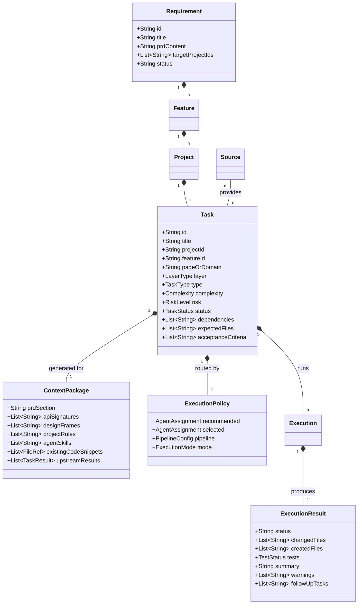
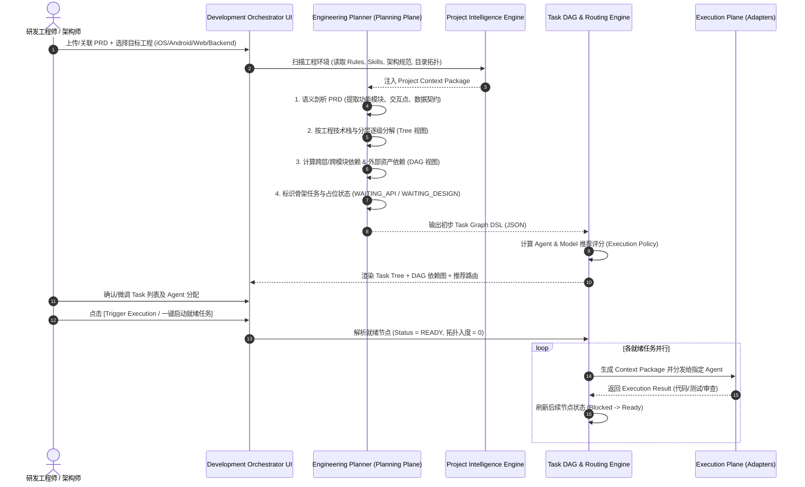

# Development Orchestrator（智能研发编排）
## 核心子系统：PRD 任务智能拆分与工程任务图生成（PRD Task Graph Generator）产品需求文档 (PRD)

---

## 1. 文档概述与产品定位

### 1.1 背景与演进理念
在多智能体（ChatGPT、Antigravity、Claude Code、TRAE、WorkBuddy 等）协同研发的实际场景中，传统 **“PRD → 粗粒度 Task → 单 Agent 执行”** 的线性模式面临以下核心瓶颈：
1. **执行边界模糊**：大模型试图一步到位生成整个功能，容易丢失上下文、幻觉超纲、破坏工程架构。
2. **多端/分层依赖割裂**：前后端、iOS/Android、数据层/UI 层的物理依赖未理清，无法并行与阻塞阻断。
3. **外部资产异步到位**：API 接口文档（Swagger/Apifox）和 UI 设计稿（Figma）往往晚于 PRD，导致开发停滞或频繁返工。
4. **智能体与模型绑定死板**：将特定角色（如 iOS 开发）硬编码给某个 Agent，无法根据任务类型（架构/编码/测试/Review）以及底层模型（GLM/Qwen/Claude/GPT）进行动态最优分配。
5. **上下文膨胀与污染**：直接给 Agent 塞入整个仓库及全量 PRD，导致 Token 浪费且命中率低。

因此，**Development Orchestrator** 升级为：
> **“PRD → Engineering Task Graph → Agent/Model Routing → 多智能体协同执行”** 的 Software Engineering Control Plane。

### 1.2 系统核心定位与职责划分
系统严格解耦为 **规划面（Planning Plane）** 与 **执行面（Execution Plane）**：

```text
┌────────────────────────────────────────────────────────────────────────┐
│                        Planning Plane (规划面)                         │
│  PRD 理解 ──> 关联工程识别 ──> 架构/技能规则注入 ──> 六层任务拆解 ──>      │
│  依赖分析 (DAG) ──> 占位骨架识别 ──> 智能路由推荐 ──> 变更 Reconcile      │
└──────────────────────────────────┬─────────────────────────────────────┘
                                   │ Context Package + Execution Policy
                                   ▼
┌────────────────────────────────────────────────────────────────────────┐
│                       Execution Plane (执行面)                         │
│  Agent Adapter ──> Model Registry ──> 环境调度 (Assisted/Autonomous) ──>│
│  代码编写/修改 ──> 测试生成与验证 ──> Review 校验 ──> 统一结果回写        │
└────────────────────────────────────────────────────────────────────────┘
```

- **核心原则**：
  - **任务属于工作台**：Task 是平台一等公民，不依附于任何具体智能体，智能体仅作为执行器（Executor）。
  - **人机双重视角**：**Task Tree** 面向人类（反映需求、工程、模块、分层），**Task DAG** 面向系统调度（反映拓扑依赖、并行阻塞、就绪触发）。
  - **上下文最小化**：每个 Task 仅打包自身所需的最小精准切片（PRD片段、相关API、Figma Frame、Rules、Skills、依赖文件）。
  - **异步渐进演进**：支持“骨架先行”，通过 `WAITING_API` / `WAITING_DESIGN` 状态解耦外部资产依赖，资产到达后通过 **ChangeSet Reconcile** 增量刷新。

---

## 2. 核心领域数据模型（7大实体定义）



### 2.1 任务核心模型（Task Schema）
```yaml
task:
  id: "IOS-HEALTH-104"
  title: "Implement ReportListViewModel"
  requirement_id: "REQ-2026-003"
  feature: "PetHealthReport"
  project: "PetPal-iOS"
  page_or_domain: "ReportList"
  layer: "state"                  # domain | data | state | ui | integration | test | infra
  type: "implementation"          # architecture | scaffolding | domain | data | state | ui | api-analysis | integration | test | review | refactor
  complexity: "medium"            # low | medium | high | critical
  risk: "low"                     # low | medium | high
  status: "ready"                 # draft | waiting_api | waiting_design | blocked | ready | running | done | failed

  # 依赖关系（DAG 边）
  dependencies:
    - "IOS-HEALTH-101"            # Define Report Model (DONE)
    - "IOS-HEALTH-103"            # Implement API Client (DONE)

  # 关联源资产切片
  sources:
    prd:
      section_id: "sec-3.2"
      title: "报告列表分页与下拉刷新交互"
    design:
      figma_file: "figma://file/xyz123"
      frame_id: "frame-report-list"
      status: "ready"
    api:
      operation_id: "getPetHealthReportList"
      spec_url: "apifox://api/456"
      status: "ready"

  # 预测改动与交付标准
  files:
    expected:
      - "PetPal/Features/Report/ViewModels/ReportListViewModel.swift"
      - "PetPalTests/Features/Report/ReportListViewModelTests.swift"
  acceptance_criteria:
    - "支持分页拉取（每页 20 条），处理下拉刷新重置逻辑"
    - "维护 ViewState：.idle / .loading / .loaded(items) / .empty / .error(msg)"
    - "错误时提供 retry 闭包并向 View 广播错误提示"

  # 执行策略与路由
  execution:
    mode: "assisted"              # manual | assisted | autonomous
    recommended:
      agent_id: "antigravity"
      model_id: "gemini-1.5-pro"
      score: 94
      reason: "强项为 iOS MVVM 状态流实现及多文件重构，匹配 project.md 与 ios-mvvm skill"
    selected:
      agent_id: "antigravity"
      model_id: "auto"
    pipeline:                     # 多智能体管线支持
      - role: "implement"
        agent_id: "antigravity"
        model_id: "auto"
      - role: "review"
        agent_id: "chatgpt"
        model_id: "o3-mini"
      - role: "verify"
        agent_id: "claude-code"
        model_id: "qwen-2.5-coder-32b"

  # 审查要求
  review:
    required: true
    checklist:
      - "无内存泄漏（[weak self] 正确使用）"
      - "单元测试覆盖率 > 85%"
```

---

## 3. PRD 任务智能拆分与拓扑生成全生命周期

### 3.1 业务全景时序


---

## 4. 功能详细规格与算法逻辑

### 4.1 六层工程维度分解标准（Engineering Decomposition）
拆分引擎必须严格按照以下六层梯队拆解，避免任务粒度失控：

| 层级 (Level) | 实体 (Entity) | 职责说明 | 示例 |
| :--- | :--- | :--- | :--- |
| **L1** | **Requirement** | 业务诉求全集 (PRD) | 宠物健康综合评估与历史报告优化 |
| **L2** | **Feature** | 独立可交付的业务功能特性 | 历史报告列表 (ReportList)、报告详情与图表 (ReportDetail) |
| **L3** | **Project** | 承接代码的物理工程/仓库 | `PetPal-iOS`, `PetPal-Android`, `PetPal-Backend` |
| **L4** | **Domain / Page** | 业务领域服务或前端/客户端独立页面 | 报告数据分析领域 (Domain), 报告列表页 (ReportListPage) |
| **L5** | **Layer** | 软件工程架构分层 | `architecture` / `domain` / `data` / `state` / `ui` / `integration` / `test` |
| **L6** | **Task** | **原子可执行任务单元** (单次执行耗时预估 5-20 min，改动 1-4 个文件) | `T101 Define Domain Model`, `T104 ReportListViewModel` |

---

### 4.2 任务类型（Task Types）与分层标准矩阵

```text
┌─────────────────┐   ┌─────────────────┐   ┌─────────────────┐
│   Domain Layer  │   │   Data Layer    │   │   State Layer   │
│  T101: Model    │──>│  T102: Repo     │──>│  T104: VM/Store │
│                 │   │  T103: API (⏳) │   │                 │
└─────────────────┘   └─────────────────┘   └────────┬────────┘
                                                     │
┌─────────────────┐   ┌─────────────────┐            │
│    UI Layer     │   │Integration Layer│            ▼
│  T105: Skeleton │──>│  T108: Page     │<───────────┘
│  T106: View (🎨)│   │  Integration    │
└─────────────────┘   └─────────────────┘
```

1. **`architecture`**：工程脚手架、模块通信路由注册、基础契约声明。
2. **`domain`**：纯业务实体（Entities）、Value Objects、领域计算规则。
3. **`data`**：DTO、Repository、Local Cache、网络 API 请求实现（若 API 未定则设为 `WAITING_API`）。
4. **`state`**：ViewModel、Store、Redux Slice、状态机机变流转。
5. **`ui`**：
   - **`ui-skeleton`**：根据 PRD 先行构建容器布局、占位视图、空/加载状态（不依赖设计稿）。
   - **`ui-visual`**：基于 Figma 精确排版、色彩、字体、微动效（依赖设计稿，未提供设为 `WAITING_DESIGN`）。
6. **`integration`**：组装 VM + UI + 路由跳转 + 埋点注入。
7. **`test`**：单元测试、Mock 数据集构建、UI Snapshot 测试。
8. **`review`**：架构合规性审查、安全审计、性能排查。

---

### 4.3 Task DAG 依赖分析与状态机引擎

#### 状态流转模型
```text
                  ┌────────────────────────┐
                  │         DRAFT          │
                  └───────────┬────────────┘
                              │ 依赖分析/资产检查
        ┌─────────────────────┼──────────────────────┐
        ▼                     ▼                      ▼
┌───────────────┐     ┌───────────────┐      ┌───────────────┐
│  WAITING_API  │     │WAITING_DESIGN │      │    BLOCKED    │ (前置 Task 未完成)
└───────┬───────┘     └───────┬───────┘      └───────┬───────┘
        │ API 到达            │ Figma 到达           │ 前置 Task 完成
        └─────────────────────┼──────────────────────┘
                              ▼
                      ┌───────────────┐
                      │     READY     │ (可立即调度执行)
                      └───────┬───────┘
                              │ Agent 领取 / 启动
                              ▼
                      ┌───────────────┐
                      │    RUNNING    │
                      └───────┬───────┘
                              │
                    ┌─────────┴─────────┐
                    ▼                   ▼
            ┌───────────────┐   ┌───────────────┐
            │     DONE      │   │    FAILED     │
            └───────────────┘   └───────┬───────┘
                                        │ 重试 / 人工干预
                                        └─> READY
```

#### 拓扑就绪计算算法（DAG Ready Resolver）
```typescript
function computeTaskStatus(task: Task, allTasks: Map<string, Task>): TaskStatus {
  // 1. 检查显式外部资产阻塞
  if (task.sources.api?.status === 'pending') return 'WAITING_API';
  if (task.sources.design?.status === 'pending') return 'WAITING_DESIGN';

  // 2. 检查前置依赖任务
  if (task.dependencies && task.dependencies.length > 0) {
    const hasUnfinishedDep = task.dependencies.some(depId => {
      const depTask = allTasks.get(depId);
      return !depTask || depTask.status !== 'DONE';
    });
    if (hasUnfinishedDep) {
      return 'BLOCKED';
    }
  }

  // 3. 所有前置条件满足
  return 'READY';
}
```

---

### 4.4 智能路由引擎（Agent & Model Router）

#### 路由决策因子评分公式
对于任务 $T$ 与 候选执行器 $(A, M)$（其中 $A$ 为 Agent，$M$ 为 Model），综合匹配度得分 $S(T, A, M) \in [0, 100]$ 计算如下：

$$S(T, A, M) = w_1 \cdot C_{type}(A, T.type) + w_2 \cdot C_{layer}(A, T.layer) + w_3 \cdot M_{cap}(M, T.complexity) + w_4 \cdot P_{pref}(A, M, T.project)$$

- $C_{type}$：Agent 在该任务类型上的核心能力分（0-100）。
- $C_{layer}$：工程分层与技术栈契合度（如 iOS/Swift 重构 vs 纯架构分解）。
- $M_{cap}$：模型在对应复杂度与代码上下文长度上的推理评级。
- $P_{pref}$：团队/项目自定义的默认 Execution Profile 权重偏好。
- 默认权重分配：$w_1 = 0.35, w_2 = 0.25, w_3 = 0.25, w_4 = 0.15$。

#### 默认能力配置表（Agent Profiles Baseline）
```yaml
agent_profiles:
  - id: "chatgpt"
    name: "ChatGPT"
    capabilities:
      architecture: 96
      planning: 95
      review: 95
      domain: 90
      debugging: 90
      coding: 85
    supported_models: ["gpt-4o", "o3-mini", "o1"]
    preferred_roles: ["Planner", "Architect", "Reviewer"]

  - id: "antigravity"
    name: "Antigravity"
    capabilities:
      coding: 96
      refactoring: 95
      multi_file_change: 95
      ui_implementation: 94
      debugging: 92
      testing: 90
    supported_models: ["gemini-1.5-pro", "gemini-2.0-flash", "claude-3-5-sonnet"]
    preferred_roles: ["Senior Full-stack Implementer", "Refactor Specialist"]

  - id: "claude-code"
    name: "Claude Code"
    capabilities:
      repository_analysis: 94
      testing: 94
      coding: 91
      debugging: 93
    supported_models: ["claude-3-5-sonnet", "qwen-2.5-coder-32b", "deepseek-r1"]
    preferred_roles: ["Test Engineer", "Bug Hunter", "Sub-module Implementer"]

  - id: "trae"
    name: "TRAE"
    capabilities:
      ui_skeleton: 90
      small_features: 88
      routine_coding: 86
    supported_models: ["claude-3-5-sonnet", "glm-4-plus"]
    preferred_roles: ["UI/Component Builder", "Fast Prototyper"]

  - id: "workbuddy"
    name: "WorkBuddy"
    capabilities:
      scaffolding: 88
      documentation: 92
      verification: 85
    supported_models: ["qwen-max", "glm-4-air"]
    preferred_roles: ["Documentation / Scaffolding Assistant"]
```

---

### 4.5 任务上下文切片构建器（Context Builder）

为确保 Agent 仅获得针对该任务的精准上下文，避免上下文污染和幻觉，Context Builder 严格执行 **按需切片机制**：

```text
┌───────────────────────────────────────────────────────────┐
│                   Context Package (T104)                  │
├───────────────────────────────────────────────────────────┤
│ 1. PRD Snippet      │ Section 3.2 提取 (仅包含列表与交互规范) │
│ 2. API Contract     │ getPetHealthReportList 字段结构与 DTO   │
│ 3. Design Spec      │ ReportList Figma CSS/布局图层数据       │
│ 4. Project Rules    │ iOS 规范: PetPal-iOS/rules/project.md  │
│ 5. Agent Skills     │ 注入 'ios-mvvm', 'ios-pagination'     │
│ 6. Relevant Code    │ 目标文件骨架 + ReportRepository.swift    │
│ 7. Upstream Outputs │ T101 (Domain Model) 生成的 Model 源码    │
└───────────────────────────────────────────────────────────┘
```

---

### 4.6 外部资产增量到达与 Reconcile 机制（ChangeSet Reconciler）

当需求初期缺乏 API 或 Figma 时，系统自动生成 `WAITING_API` / `WAITING_DESIGN` 骨架任务；当后续补充外部资产时，触发 **增量 Reconcile 流程**：

```text
外部输入 (Figma Frame 或 Swagger API 变更)
                    │
                    ▼
          Asset Diff Analyzer
                    │
       识别新增/变更字段与 UI 元素
                    │
                    ▼
          生成 ChangeSet #N
  - 自动更新关联 Task 的 sources 状态 (pending -> ready)
  - 自动刷新 Task 状态 (WAITING_API / WAITING_DESIGN -> READY)
  - 增量生成适配补丁任务 (如: "Adapt ViewState with new error code 40301")
                    │
                    ▼
          重新计算 DAG 拓扑就绪集
```

---

## 5. 交互与界面规范（UI/UX Specification）

### 5.1 主界面布局：三栏联动工作台
```text
┌───────────────────────────────────────────────────────────────────────────────────────────────────────────────┐
│  DEVELOPMENT ORCHESTRATOR  >  [REQ-2026-003] 宠物健康报告改版  [ 42 Tasks | 12 Done | 3 Running | 14 Ready ]     │
├───────────────────┬───────────────────────────────────────────────────────────┬───────────────────────────────┤
│ FEATURE / PROJECT │ TASK GRAPH / LIST VIEW          [ Tree View | DAG View ]  │ TASK INSPECTOR (T104)         │
├───────────────────┼───────────────────────────────────────────────────────────┼───────────────────────────────┤
│ ▼ PetHealthReport │  [+] New Task   [⚡ Batch Assign]   [▶ Run Ready (14)]    │ T104 Implement ViewModel      │
│   ▼ PetPal-iOS    │                                                           │ ----------------------------- │
│     ▶ Domain (2)  │  ☑ [DONE]   T101 Define Report Models                     │ Layer: State · iOS            │
│     ▼ ReportList  │             ChatGPT · gpt-4o · 2 files                    │ Type:  Implementation         │
│       T101 Model  │                                                           │ Status: ● READY               │
│       T102 Repo   │  ☑ [DONE]   T102 Create Report Repository                 │                               │
│       T103 API    │             Antigravity · gemini-pro · 1 file             │ EXECUTOR ROUTING              │
│     ● T104 VM     │                                                           │ [Recommended: 94% Match]      │
│       T105 Skel   │  ☐ [READY]  T104 Implement ReportListViewModel            │ ● Antigravity  Model: Auto ▼  │
│       T106 UI     │             Antigravity · Auto [94% Match]                │ ○ ChatGPT      Model: gpt-4o  │
│       T107 Integ  │                                                           │ ○ Claude Code  Model: Qwen    │
│     ▶ ReportInfo  │  ☐ [WAIT]   T106 Implement Visual UI                      │                               │
│   ▶ PetPal-Android│             ⏳ Waiting Figma Design (Frame #302)           │ DEPENDENCIES                  │
│   ▶ PetPal-Backend│                                                           │ ✓ T101 Domain Model (Done)    │
│                   │  ☐ [BLOCK]  T107 Integrate Report List Page               │ ✓ T103 API Client (Done)      │
│                   │             ⛔ Blocked by: T104, T106                     │                               │
│                   │                                                           │ CONTEXT PACKAGE [5/5 Ready]   │
│                   │                                                           │ [PRD §3.2] [API ✓] [Skills ✓] │
│                   │                                                           │                               │
│                   │                                                           │ [📦 View Context] [▶ Execute] │
└───────────────────┴───────────────────────────────────────────────────────────┴───────────────────────────────┘
```

### 5.2 顶部智能体负载与状态看板（Workload Monitor）
```text
┌───────────────────────────────────────────────────────────────────────────────────────────────────────────────┐
│ STATUS:  ● 12 DONE   ● 3 RUNNING   ● 14 READY   ● 8 BLOCKED   ● 3 WAIT API   ● 2 WAIT DESIGN                  │
│ AGENTS:  ChatGPT [██████ 6]   Antigravity [██████████ 10]   Claude Code [███ 3]   TRAE [██ 2]   WorkBuddy [█ 1]│
└───────────────────────────────────────────────────────────────────────────────────────────────────────────────┘
```

---

## 6. Planner 智能体 Prompt 编排与结构化输出规范

当系统调用 Planner（如 ChatGPT / Antigravity Planner）执行任务拆分时，输入结构化系统 Prompt，并强制以 JSON Schema 输出：

### 6.1 Planner Agent System Prompt 规范
```markdown
You are the Lead Engineering Architect and Task Decomposition Specialist in the Development Orchestrator system.
Your mission is to analyze the provided PRD, target project repositories, architectural rules, and skills, then generate a comprehensive, highly-structured Engineering Task Graph.

### Guidelines:
1. Break down features into strict 6-level hierarchy: Requirement -> Feature -> Project -> Page/Domain -> Layer -> Task.
2. Separate Domain, Data, State, UI, Integration, and Verification into isolated, granular tasks (each task should touch 1-4 files).
3. Do NOT create monolithic tasks like "Implement Health Report Page". Split into "Skeleton", "State/VM", "API Client", "Visual UI", "Integration".
4. Mark tasks as `WAITING_API` if API endpoints are not finalized, and `WAITING_DESIGN` if Figma visual frames are missing.
5. Identify exact DAG dependencies between tasks.
6. Provide recommended Agent & Model based on task type (e.g. Architecture/Review -> ChatGPT; Implementation/Refactor -> Antigravity; Testing -> Claude Code).
7. List expected files, acceptance criteria, and specific rules/skills required for each task.
```

### 6.2 拆分结果输出 JSON Schema 约束
```json
{
  "$schema": "http://json-schema.org/draft-07/schema#",
  "title": "TaskDecompositionResult",
  "type": "object",
  "required": ["requirement_id", "features", "tasks", "dag_edges"],
  "properties": {
    "requirement_id": { "type": "string" },
    "summary": { "type": "string" },
    "features": {
      "type": "array",
      "items": {
        "type": "object",
        "required": ["id", "name", "target_projects"],
        "properties": {
          "id": { "type": "string" },
          "name": { "type": "string" },
          "target_projects": { "type": "array", "items": { "type": "string" } }
        }
      }
    },
    "tasks": {
      "type": "array",
      "items": {
        "type": "object",
        "required": ["id", "title", "project", "feature", "layer", "type", "dependencies", "status", "execution"],
        "properties": {
          "id": { "type": "string" },
          "title": { "type": "string" },
          "project": { "type": "string" },
          "feature": { "type": "string" },
          "page_or_domain": { "type": "string" },
          "layer": { "type": "string", "enum": ["architecture", "domain", "data", "state", "ui", "integration", "test", "review"] },
          "type": { "type": "string", "enum": ["scaffolding", "implementation", "api-mapping", "ui-skeleton", "ui-visual", "integration", "test", "review", "refactor"] },
          "complexity": { "type": "string", "enum": ["low", "medium", "high", "critical"] },
          "risk": { "type": "string", "enum": ["low", "medium", "high"] },
          "status": { "type": "string", "enum": ["draft", "waiting_api", "waiting_design", "blocked", "ready"] },
          "dependencies": { "type": "array", "items": { "type": "string" } },
          "sources": {
            "type": "object",
            "properties": {
              "prd_section": { "type": "string" },
              "design_frame": { "type": "string" },
              "api_endpoint": { "type": "string" }
            }
          },
          "files": {
            "type": "object",
            "properties": {
              "expected": { "type": "array", "items": { "type": "string" } }
            }
          },
          "acceptance_criteria": { "type": "array", "items": { "type": "string" } },
          "execution": {
            "type": "object",
            "required": ["recommended"],
            "properties": {
              "recommended": {
                "type": "object",
                "required": ["agent_id", "score", "reason"],
                "properties": {
                  "agent_id": { "type": "string" },
                  "model_id": { "type": "string" },
                  "score": { "type": "number" },
                  "reason": { "type": "string" }
                }
              }
            }
          }
        }
      }
    },
    "dag_edges": {
      "type": "array",
      "items": {
        "type": "object",
        "required": ["from", "to", "type"],
        "properties": {
          "from": { "type": "string" },
          "to": { "type": "string" },
          "type": { "type": "string", "enum": ["hard_dependency", "soft_reference", "asset_gate"] }
        }
      }
    }
  }
}
```

---

## 7. 执行器适配层（Agent Adapter）设计

工作台不硬编码任何具体 Agent 的底层细节，通过统一的 `AgentAdapter` 接口进行生命周期管理：

```typescript
export interface ExecutionPlan {
  taskId: string;
  contextPackage: ContextPackage;
  selectedModel: string;
  mode: 'manual' | 'assisted' | 'autonomous';
}

export interface ExecutionResult {
  taskId: string;
  agentId: string;
  modelId: string;
  status: 'success' | 'failed' | 'cancelled';
  changedFiles: string[];
  createdFiles: string[];
  testStatus?: 'passed' | 'failed' | 'skipped';
  summary: string;
  warnings: string[];
  followUpTaskSuggestions?: string[];
}

export interface AgentAdapter {
  id: string;
  name: string;
  
  // 准备执行计划与 Context 注入
  prepare(task: Task, context: ContextPackage): Promise<ExecutionPlan>;
  
  // 启动执行
  execute(plan: ExecutionPlan, onProgress?: (log: string) => void): Promise<ExecutionResult>;
  
  // 中断或取消
  cancel(executionId: string): Promise<void>;
  
  // 获取实时运行状态与诊断
  getStatus(executionId: string): Promise<{ state: string; currentStep: string }>;
}
```

---

## 8. 版本演进规划（Roadmap）

### 8.1 第一阶段（V1 MVP - 研发编排骨架与协同执行）
- **目标**：实现从 PRD 到任务树拆解、DAG 依赖分析、基础推荐路由与 Assisted 执行闭环。
- **关键交付**：
  1. **PRD 拆解引擎**：支持 Markdown PRD 上传/粘贴，调用 Planner 生成标准六层 Task Tree 与 DAG。
  2. **可视化看板**：Task Graph 列表视图与树视图，支持筛选 Ready、Blocked、Waiting 状态。
  3. **Agent 路由与分配**：内置 ChatGPT、Antigravity、Claude Code、TRAE 的 Profile；支持人工调整与按层分配。
  4. **Context Package 生成**：自动抽取 PRD 片段、关联 Rules、Skills 与目标文件路径。
  5. **Assisted 执行模式**：一键将 Context Package 格式化输出为可直接消费的 Prompt / CLI 指令，支持手动回写结果。

### 8.2 第二阶段（V2 进阶 - 智能拓扑调度与动态资产 Reconcile）
- **目标**：实现多 Agent 自动化管线流转与自适应学习。
- **关键交付**：
  1. **DAG 自动化调度执行（Autonomous Mode）**：前置 Task 完成后自动触发下游就绪任务，多 Agent 并发执行。
  2. **外部资产监听与 Reconcile**：Figma 插件 / Swagger 变更自动触发 ChangeSet 计算并增量唤醒 `WAITING` 任务。
  3. **基于实际研发数据的路由自进化**：记录各 Agent/Model 在特定语言、特定层级任务上的成功率、耗时、Token 消耗及 Review 打回率，自动迭代匹配评分权重。
  4. **多 Agent 组合流水线（Pipeline Execution）**：单个任务自动化流转 `Implement (Antigravity) -> Review (ChatGPT) -> Verify (Claude Code)`。
